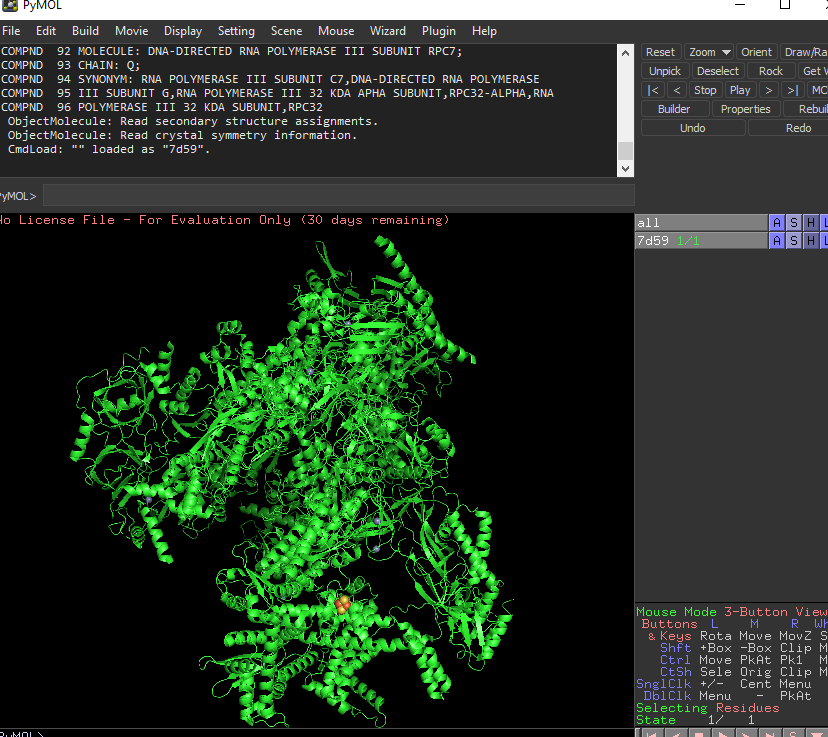
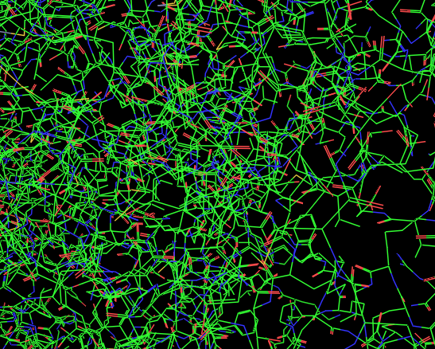
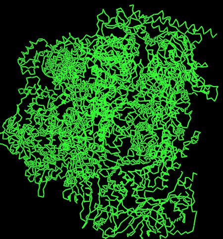
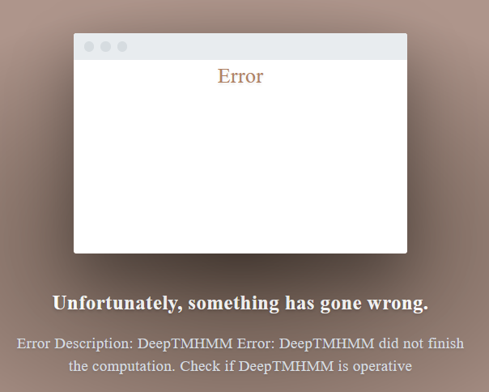
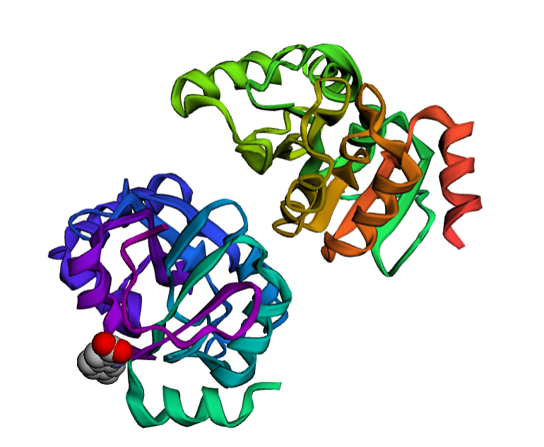

## TASK 1
[human RNA polymerase](https://www.rcsb.org/structure/7D59)


## TASK 2




## TASK 3




## TASK 4

Sticks in chemical visualization are a simplified representation used to visually depict molecular structures in chemistry. It involves representing atoms as sticks and bonds as lines connecting the atoms. 

## TASK 5

Cartoon visualization aids in understanding the overall folding and three-dimensional structure of proteins and is often used in protein structure analysis and molecular modeling. It involves representing proteins as ribbons or tubes, where the backbone of the protein is shown as a smooth, continuous curve. 

## TASK 6




## TASK 7

Ribbon visualization is widely used in protein structure analysis, molecular modeling, and structural biology research. It provides a clear and intuitive representation of protein structures, making it easier to analyze and interpret the arrangement of secondary structure elements within a protein molecule.

## TASK 8

Based on the protein prediction graph, it seems that there are some regions in the protein sequence that are likely to form alpha helices and beta sheets. These structural elements might contribute to the way the protein folds and how stable it is. Additionally, the presence of loops suggests that the protein may have flexible regions that could be involved in various functions.

## TASK 9 

    "H" denotes a predicted alpha helix (a tightly coiled structure).
    "E" represents a predicted beta strand or beta sheet (a more extended structure).
    "C" indicates a predicted coil or loop region (neither helix nor strand).
    "T" Uncertainty

## TASK 10

 "Number of predicted TMHs" refers to the number of predicted transmembrane helices (TMHs) in a protein sequence. 

## TASK 11

Exp number of AAs in TMHs: 68.6888999999999 indicates the expected number of amino acids (AAs) that are predicted to be located within transmembrane helices (TMHs) in a protein sequence.

## TASK 12

The plot of probabilities provides valuable insights into the predicted secondary structure of the protein While the main prediction might not capture all weak transmembrane helices, the plot helps identify potential regions that were not initially predicted. Additionally, it offers a way to assess the certainty of each segment in the prediction by examining the probabilities.

## TASK 14




## TASK 15

Unfortunatelly I was unable to finish this task as the service went down 

## TASK 16

https://doi.org/10.2210/pdb5RT0/pdb

## TASK 17




## TASK 18

valine

## TASK 19

The numbers first three numbers are the X, Y, and Z coordinates, respectively, of the atom in three-dimensional space. 

The fourth number, represents the occupancy or occupancy factor of the atom. It indicates the fraction of time the atom is present in that specific position in the crystal structure.

The fifth number, represents the temperature factor. It reflects the overall mobility or thermal vibration of the atom. 

## TASK 20

The "Fold Assignment Methods" option controls the sampling and alignment methods used in determining sequence-structure alignments. 
Each following technique yields better results, utilising more complex tools, but the time computation significantly increases.

## TASK 21


## TASK 24


```python
def mark_proline(sequence):
    marked_sequence = ""
    for i in range(len(sequence)):
        if sequence[i] == 'P':
            marked_sequence += "*P"
        else:
            marked_sequence += sequence[i]
    return marked_sequence

# Przykładowe dane wejściowe
protein_sequence = input("Wprowadź sekwencję białka: ")

# Oznaczanie proliny w sekwencji
marked_sequence = mark_proline(protein_sequence)

# Wyświetlanie wyniku
print("Sekwencja z oznaczoną proliną:")
print(marked_sequence)
```
